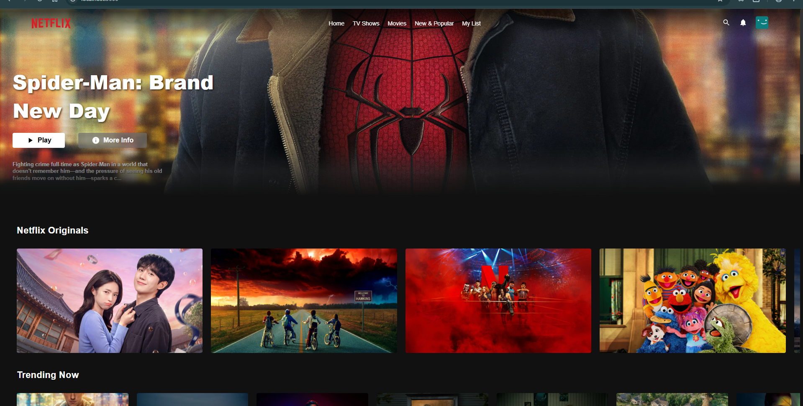

# Netflix Clone 🍿

A modern, minimal, and responsive **Netflix Clone** built for browsing movies and TV shows, discovering trending titles, searching for your favorite content, and enjoying a seamless cinematic UI experience.

Live Link :- https://netflix-clone-popcorn.vercel.app

---

## 📸 Screenshots

| Home Screen |
|:-----------:|
|  |

---

## ✨ Features

- 🎬 **Dynamic Movie Catalog** 
  Browse trending, popular, top-rated, and genre-specific movies and TV shows.

- 🔍 **Real-Time Search** 
  Quickly search for movies and shows using the TMDB API.

- 📺 **Movie & TV Show Details** 
  View posters, backdrops, ratings, release dates, descriptions, genres, and other information.

- 🔥 **Trending Content** 
  Discover what's currently popular and trending.

- 🎭 **Genre-Based Browsing** 
  Explore content based on different movie and TV genres.

- 📱 **Fully Responsive Design** 
  Optimized for mobile, tablet, laptop, and desktop screens.

- ⚡ **Fast & Modern UI** 
  Built with a clean component-based architecture for a smooth experience.

- 🌙 **Netflix-Inspired Dark Theme** 
  A cinematic dark interface inspired by modern streaming platforms.

---

## 🛠️ Tech Stack

### Frontend

- [React](https://react.dev/)
- [Next.js](https://nextjs.org/)

### Styling

- [Tailwind CSS](https://tailwindcss.com/)

### API

- [TMDB API](https://www.themoviedb.org/documentation/api)

### Development

- JavaScript / TypeScript
- npm
- REST API

---

## 📂 Project Structure

```text
netflix-clone/
├── public/
│   ├── images/
│   └── icons/
│
├── src/
│   ├── components/
│   ├── pages/
│   ├── app/
│   ├── hooks/
│   ├── lib/
│   └── styles/
│
├── .env.local
├── .gitignore
├── package.json
├── tailwind.config.js
├── next.config.js
└── README.md